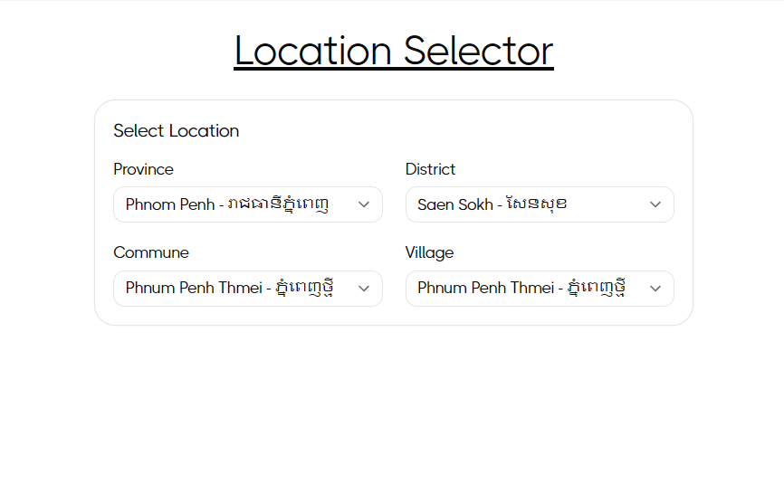
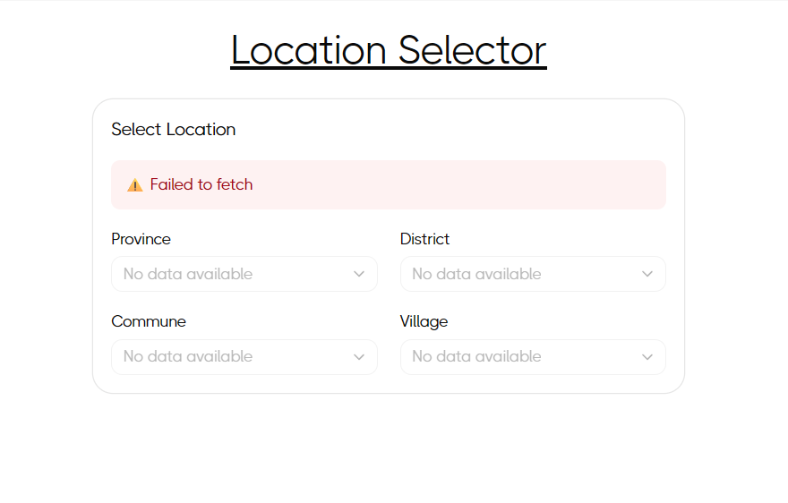

This is a [Next.js](https://nextjs.org) project bootstrapped with [`create-next-app`](https://nextjs.org/docs/app/api-reference/cli/create-next-app).

## Quick Start

### 1. Clone the Repository

```bash
git clone https://github.com/jimtwenty2/location-selector.git
cd final-project-testing
```

### 2. Install Dependencies

```bash
npm install
```

### 3. Configure Environment (Optional)

Create a `.env.local` file in the root directory:

```
NEXT_PUBLIC_API_URL=http://localhost:8000
```

### 4. Run the Development Server

```bash
npm run dev
```

### 5. Open in Browser

Navigate to [http://localhost:3000](http://localhost:3000)

### 6. Test the Location Selector Route

Go to: [http://localhost:3000/select-location](http://localhost:3000/select-location)

You should see the **Location Selector** component with Province, District, Commune, and Village dropdown fields.

### Testing Error Handling

- If the API is not configured or unreachable, you'll see an error message
- The component will gracefully handle the failure and show "No data available"
- Check the browser console for detailed error logs

## Component Overview

### Location Selector

#### Preview



#### Error state (example)



The Location Selector component provides a cascading dropdown interface with automatic fallback when the API is unavailable.
